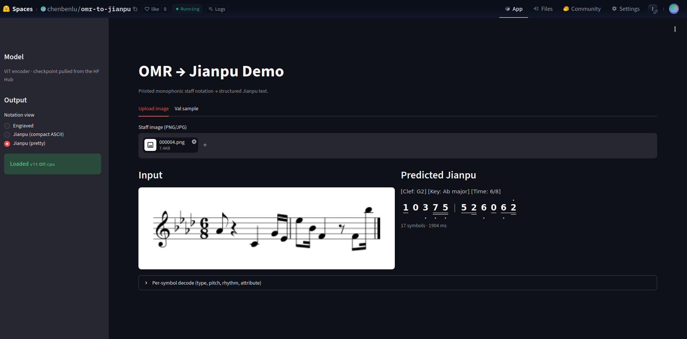
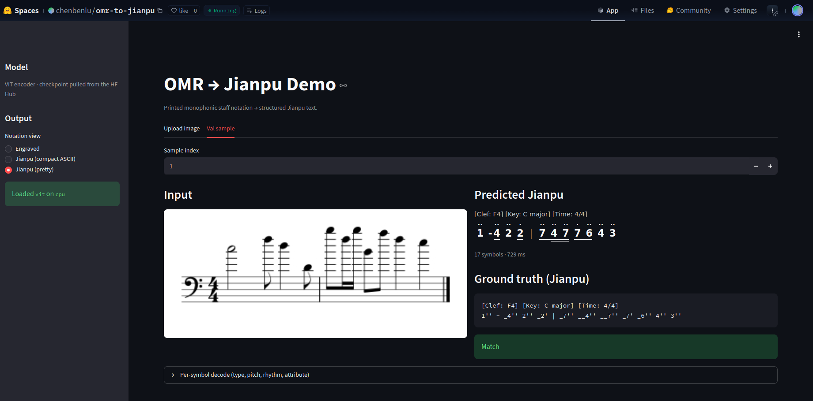
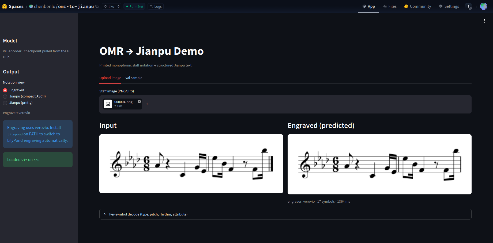
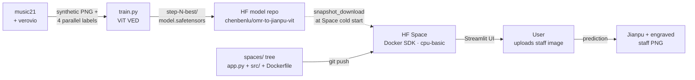

# OMR-to-Jianpu

End-to-end deep-learning Optical Music Recognition. A Vision-Encoder-Decoder
translates printed monophonic staff-notation images into structured semantic
tokens, which downstream are mapped to
[Jianpu](https://en.wikipedia.org/wiki/Numbered_musical_notation) (numbered
notation) — no MusicXML, no MIDI, no rule-based heuristics in the model path.

Images are **100% synthetic** (music21 builds a Stream → verovio renders it
to PNG). Labels come from the generator as four parallel streams
(`type` / `pitch` / `rhythm` / `attribute`) so pitch and rhythm accuracy can
be scored independently across encoder variants.

NYCU 535354 Deep Learning final project (Track 3 — Application). Team:
BEN-LU CHEN, CHUN-JUI HSU, MENG-XI LIN, JIAN-AN ZHU. Full proposal:
[docs/proposal/proposal.pdf](docs/proposal/proposal.pdf).

## Live demo

🎼 **<https://huggingface.co/spaces/chenbenlu/omr-to-jianpu>** — upload a
staff image (or pick one of 20 bundled validation samples) and watch the
model predict Jianpu, render it as a CSS-grid pretty score, and engrave the
prediction back to staff notation. Streamlit on Docker, free CPU tier,
~10–30 s greedy decode per image. Weights:
[`chenbenlu/omr-to-jianpu-vit`](https://huggingface.co/chenbenlu/omr-to-jianpu-vit).

| Upload tab | Val-sample tab | Engraved view |
|---|---|---|
|  |  |  |

## Results

Same 4-head decoder, same losses, same data — only the encoder front-end
changes. Validation: 1 000 pre-rendered synthetic samples.

| encoder | Symbol Error Rate ↓ | pitch acc | rhythm acc | notes |
|---|---|---|---|---|
| **ViT (base)** | **0.0029** | **99.85 %** | **99.78 %** | pretrained on ImageNet; shipped on the Space |
| ResNet (scratch) | ~1.10 | ~0 % | ~30–40 % | structural ceiling — see [src/model/README.md](src/model/README.md) |

The ResNet result is a documented structural limit, not a tuning failure: a
translation-equivariant CNN that collapses image height into one token per
column cannot encode *absolute vertical position*, which is exactly what
pitch is. Rhythm (per-column) still learns; pitch is pinned at the NULL-only
floor regardless of LR / pooling / vertical-resolution / vertical-pos-emb
sweeps. The encoder ablation is the project's main empirical contribution.

## Deployment flow



See [spaces/README.md](spaces/README.md) for the Space repo's own docs, and
[src/deploy/README.md](src/deploy/README.md) for the underlying inference
API.

## Quick start

You need WSL2 + Docker Desktop with the NVIDIA Container Toolkit, on a
machine with a Blackwell GPU (RTX 5060 / 5070). In VS Code, open the repo
and "Reopen in Container" — picks up
[.devcontainer/devcontainer.json](.devcontainer/devcontainer.json) and
installs the pre-commit hooks for you. From a CLI:

```bash
make build       # ~10 min first time
make shell       # bash as the non-root `omr` user inside the container
make gpu-test    # 2048×2048 GPU matmul — confirms sm_120 kernels are present
```

The Dockerfile pins `pytorch/pytorch:2.8.0-cuda12.8-cudnn9-devel` — **do not
downgrade**. Blackwell GPUs are `sm_120`; PyTorch wheels < 2.7 ship kernels
only up to `sm_90`, run `nvidia-smi` fine, then crash on every actual GPU op
with `CUDA error: no kernel image is available for execution on the device`.

## Repository layout

```
src/
  data/      Member A — synthetic generator + DataLoaders (music21 + verovio)
  model/     Member B — Vision-Encoder-Decoder + training loop
  postproc/  Member C — decoupled tokens → Jianpu mapping
  deploy/    Member D — inference API + Streamlit UI
spaces/      Hugging Face Space assembly tree (gitignored; own .git/)
configs/     Hydra configs
docs/        Proposal, Git workflow, screenshots
tests/       pytest (CPU-only)
```

Per-module READMEs: [data](src/data/README.md) · [model](src/model/README.md)
· [postproc](src/postproc/README.md) · [deploy](src/deploy/README.md). Branch
naming, PR policy, and conflict resolution:
[docs/GIT_WORKFLOW.md](docs/GIT_WORKFLOW.md).

## Citation

```bibtex
@misc{omr2jianpu2026,
  author       = {Chen, Ben-Lu and Hsu, Chun-Jui and Lin, Meng-Xi and Zhu, Jian-An},
  title        = {OMR-to-Jianpu: End-to-end Vision-Encoder-Decoder for printed monophonic staff notation},
  year         = {2026},
  howpublished = {\url{https://github.com/chenbenlu/omr-jianpu}},
  license      = {Apache-2.0},
  note         = {NYCU 535354 Deep Learning final project (Track 3 — Application). Live demo: \url{https://huggingface.co/spaces/chenbenlu/omr-to-jianpu}}
}
```

## License

[Apache License 2.0](LICENSE) © 2026 Ben-Lu Chen.
